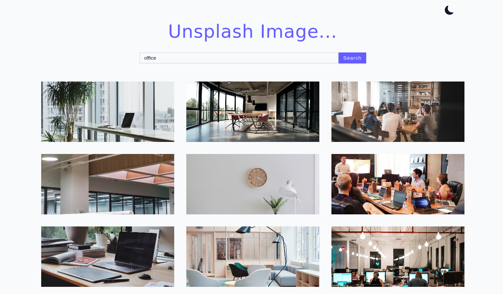

# Welcome 👋
# Unsplash image search app

I picked ReactJS for this project. Used plain CSS, didn't pick any CSS library cause this was a very short CSS code.

## Built with
- Semantic HTML5 markup
- Vanilla CSS
- Unsplash API
- ReactJS
- React Query
- React icons

## Project Live URL

See here the live project: [click here](https://unsplash-image-search-alpha.vercel.app/)